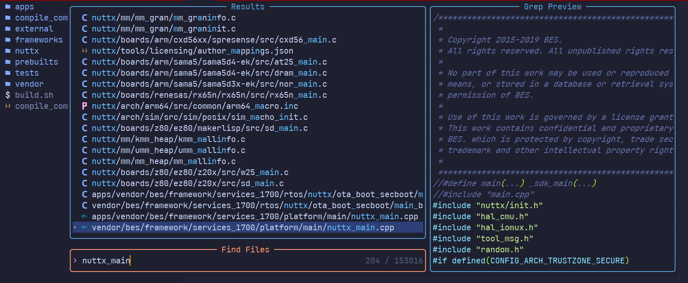
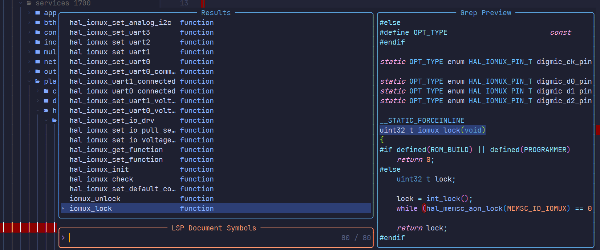
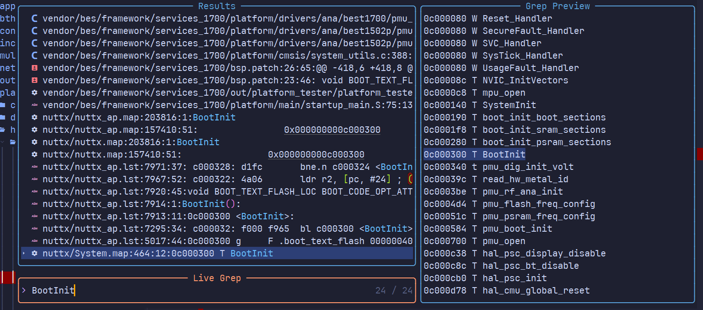
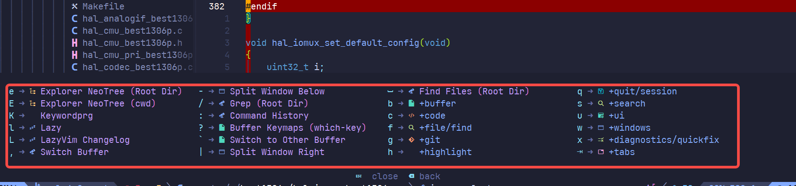

# nvim-lazy

​       懒人福音，开箱即用阅读代码工具包，neovim使用官网版本`NVIM v0.11.0`，配合lazyvim插件集合完成代码阅读工具的集成。

## 系统要求

1. ubuntu 20+（主要依赖GLIBC v28+）
2. x86-64系统
3. Git >= 2.19.0
4. Nerd Font(v3.0 or greater)
5. terminal for supporting OSC52(`WindTerm`, `WezTerm`, `iTerm2`, etc.)

## 目录结构介绍

- dot-config-nvim，nvim的config目录，在本机上的形式`~/.config/nvim`
- dot-local-share-nvim，nvim插件目录，在本机上的形式`~/.local/share/nvim`
- bin-nvim-linux64，64位nvim的可执行程序，需要配置到本机的PATH环境变量中
- tools，辅助工具目录，包含bear工具用于生成compile_commands.json

## 使用介绍

- 克隆本仓库到本地
- 执行`./nvim_install.sh`进行本地化安装
- `cd`到目标项目代码的根目录，执行`nvim .`即可打开项目代码进行阅读与修改

## 快捷键介绍

1. 前导按键（`leader key`）：`<space>`

2. 查找文件: `<space><space>`，连续按两次空格键，输入部分/全部文件名，支持模糊匹配

   

3. 列出当前文件的符号列表：`<space>ss`

   

4. 全局搜索特定的符号：`<space>/`

   

5. 命令列表：`<space>`

   

6. 窗口操作

   | 键位       | 描述             | 模式 |
   | ---------- | ---------------- | ---- |
   | <C-h>      | 跳到光标左侧窗口 | n,t  |
   | <C-j>      | 跳到光标下方窗口 | n,t  |
   | <C-k>      | 跳到光标上方窗口 | n,t  |
   | <C-l>      | 跳到光标右侧窗口 | n,t  |
   | <C-Up>     | 增加窗口高度     | n    |
   | <C-Down>   | 减少窗口高度     | n    |
   | <C-Left>   | 减少窗口宽度     | n    |
   | <C-Right>  | 增加窗口宽度     | n    |
   | <leader>ww | 切换到其他窗口   |      |
   | <leader>wd | 关闭窗口         |      |
   | <leader>-  | 下方分割窗口     |      |
   | <leader>\| | 右侧分割窗口     |      |
   | <leader>wm | 窗口最大化       |      |
   |            |                  |      |

7. 移动操作

   | 键位  | 描述     | 模式  |
   | ----- | -------- | ----- |
   | <A-j> | 向下移动 | n,i,v |
   | <A-k> | 向上移动 | n,i,v |
   | <A-h> | 向左移动 |       |
   | <A-l> | 向右移动 |       |
   |       |          |       |
   |       |          |       |
   |       |          |       |

8. 缓冲区操作

   | 键位       | 描述               | 模式 |
   | ---------- | ------------------ | ---- |
   | <S-h>      | 切换上一个缓冲区   | n    |
   | <S-l>      | 切换下一个缓冲区   | n    |
   | [b         | 切换到上一个缓冲区 | n    |
   | ]b         | 切换到下一个缓冲区 | n    |
   | <leader>bb | 切换到其他缓冲区   |      |
   | ```        | 切换到其他缓冲区   |      |
   |            |                    |      |

9. 文件操作

   | 键位       | 描述                 | 模式 |
   | ---------- | -------------------- | ---- |
   | <leader>fn | 新建文件(w new_name) | n    |
   | <C-s>      | 保存文件             |      |
   | <leader>r  | 文件重命名           |      |
   | <leader>e  | 打开/关闭目录树      |      |
   | d          | 删除文件             |      |
   | y          | 拷贝文件             |      |
   | p          | 粘贴文件             |      |
   | x          | 剪切文件             |      |
   | m          | 重命名文件           |      |

10. 搜索操作

    | 键位            | 描述                            | 模式 |
    | --------------- | ------------------------------- | ---- |
    | <leader><space> | 根目录下搜索文件，tab键切换文件 |      |
    | <leader>:       | 历史指令                        |      |
    | <leader>ff      | 搜索文件（根目录）              |      |
    | <leader>fF      | 搜索文件（当前目录）            |      |
    | <leader>fr      | 最近打开的文件                  |      |
    | <leader>fg      | 搜索被git管理的文件             |      |
    | <leader>sg      | grep根目录                      |      |
    | <leader>sG      | grep当前目录                    |      |
    | <leader>/       | grep根目录                      |      |
    | <esc><esc>      | 退出搜索模式                    |      |
    | <leader>ss      | goto symbols（当前文件）        |      |
    | <leader>sS      | goto sysmbols(全局文件)         |      |
    | <leader>st      | TODO                            |      |
    |                 |                                 |      |

    

11. 终端操作

    | 键位       | 描述           | 模式 |
    | ---------- | -------------- | ---- |
    | <leader>ft | 打开终端       |      |
    | <leader>fT | 打开终端       |      |
    | <C-/>      | 打开或隐藏终端 |      |
    | <C-->      | 缩小终端字体   |      |
    | <C-=>      | 增大终端字体   |      |
    |            |                |      |
    |            |                |      |

    

12. tab操作

13. 帮助操作

    | 键位       | 描述                            | 模式 |
    | ---------- | ------------------------------- | ---- |
    | <leader>K  | 光标下关键字文档，一般是man手册 |      |
    | <leader>sh | nvim帮助文档                    |      |
    | <leader>sM | man手册                         |      |
    | <leader>so | 打开option窗口                  |      |
    | <C-d>      | 命令行模式下打开指令列表        |      |
    | LspInfo    | 命令行下操作打开LSP信息窗口     |      |
    |            |                                 |      |

    

14. git操作

    | 键位       | 描述              | 模式 |
    | ---------- | ----------------- | ---- |
    | <leader>gg | 打开lazygit界面   |      |
    | q          | 在lazygit界面退出 |      |
    | <leader>gs | 打开status窗口    |      |
    | <leader>gc | 打开commit窗口    |      |
    |            |                   |      |
    |            |                   |      |
    |            |                   |      |

    

15. 折叠

    | 键位 | 描述                   | 模式 |
    | ---- | ---------------------- | ---- |
    | zc   | 折叠当前代码           |      |
    | zC   | 递归折叠当前可折叠代码 |      |
    | zo   | 打开当前折叠代码       |      |
    | zO   | 递归展开当前折叠代码   |      |
    |      |                        |      |

    

## 参考

[neovim](https://neovim.io/)

[lazyvim](https://www.lazyvim.org/)
