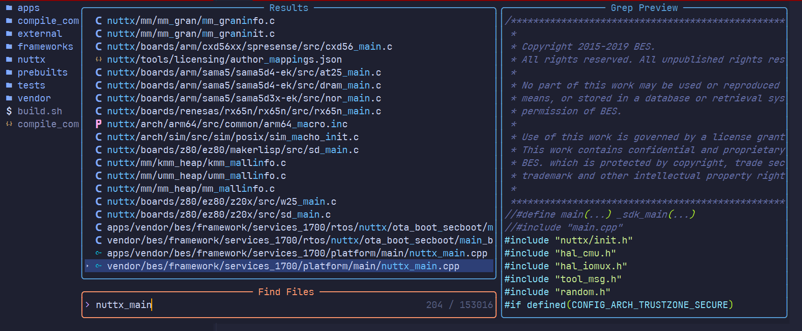
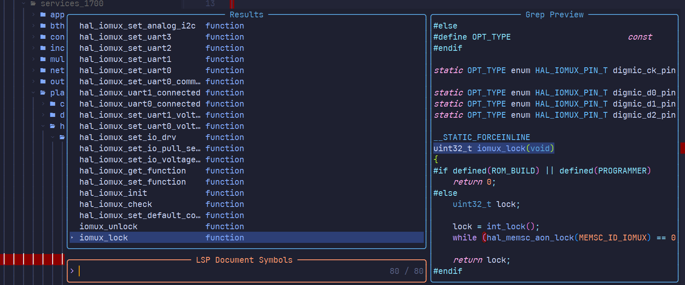
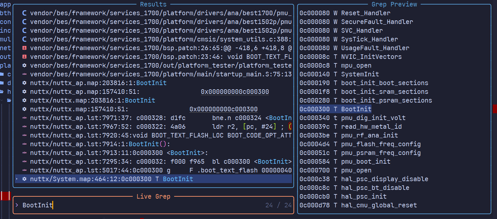
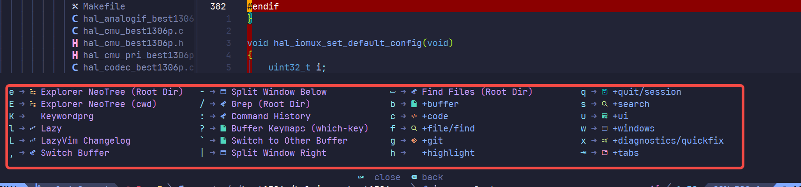

# ai-lazy-nvim

> 懒人福音，开箱即用的代码阅读 / 编辑工具包。基于 Neovim 官方版本 `NVIM v0.11.0`，配合 [LazyVim](https://www.lazyvim.org/) 插件集合，实现 LSP、补全、搜索、调试、Git 等一站式集成。

执行一次 `./nvim_install.sh`，即可在目标机器上获得与本仓库完全一致的 Neovim 开发环境（含所有插件与 Mason 工具链的二进制），无需联网拉取插件。

---

## 目录

- [特性](#特性)
- [系统要求](#系统要求)
- [项目目录结构](#项目目录结构)
- [快速安装](#快速安装)
- [卸载 / 重装](#卸载--重装)
- [快捷键速查](#快捷键速查)
- [辅助工具](#辅助工具)
- [配置覆盖 SOP](#配置覆盖-sop)
- [截图预览](#截图预览)
- [参考](#参考)

---

## 特性

- 基于官方 `NVIM v0.11.0` Linux x86-64 预编译包，免编译
- 内置完整 LazyVim 插件目录（`dot-local-share-nvim`），离线即可启动
- 内置 Mason 管理的 LSP / DAP / Formatter / Linter 二进制（clangd、clang-format、lua-language-server、rust-analyzer、debugpy 等）
- 提供 `Bear` 源码包，用于为 C/C++ 项目生成 `compile_commands.json`
- 通过 Git LFS 托管大体积二进制（`clangd`、`clang-tidy`）
- 附插件版本快照（`plugins-version/plugins-vers.txt`），便于复现环境

## 系统要求

1. Ubuntu 20+（主要依赖 `GLIBC v2.28+`）
2. x86-64 架构
3. Git `>= 2.19.0`
4. [Git LFS](https://git-lfs.com/)（克隆时用于拉取 clangd 等大文件）
5. [Nerd Font](https://www.nerdfonts.com/) `v3.0` 及以上（终端字体）
6. 支持 OSC52 的终端，推荐：`WindTerm`、`WezTerm`、`iTerm2` 等

## 项目目录结构

```
ai-lazy-nvim/
├── ai-lazy-nvim.code-workspace   # VS Code 工作区文件
├── nvim_install.sh               # 一键安装脚本
├── README.md                     # 本文档
├── README_zh-cn.md               # 简要中文说明
│
├── bin-nvim-linux64/             # 官方 Neovim 预编译二进制
│   ├── bin/                      # 可执行文件 (nvim)
│   ├── lib/                      # 运行时库
│   └── share/                    # 共享资源
│
├── dot-config-nvim/              # 对应 ~/.config/nvim
│   ├── init.lua                  # 入口
│   ├── lazy-lock.json            # 插件版本锁定
│   ├── lazyvim.json              # LazyVim extras 配置
│   ├── stylua.toml               # Lua 格式化配置
│   ├── LICENSE
│   ├── README.md
│   └── lua/
│       ├── config/               # 基础配置 (keymaps, options, autocmds)
│       └── plugins/              # 自定义/覆盖插件
│           ├── docs-view.lua
│           ├── example.lua
│           ├── gentags_plugin/
│           ├── neo-tree.luaa
│           ├── plenary_plugin/
│           └── supertab.lua
│
├── dot-local-share-nvim/         # 对应 ~/.local/share/nvim
│   ├── lazy/                     # Lazy.nvim 管理的全部插件
│   └── mason/                    # Mason 管理的 LSP/DAP/工具链二进制
│
├── plugins-version/
│   └── plugins-vers.txt          # 插件 git commit 版本快照
│
├── tools/                        # 辅助脚本与工具
│   ├── Bear-2.4.3.tar.gz         # 生成 compile_commands.json 的工具源码
│   ├── find-changes.sh           # 批量检测 lazy 目录下各插件的本地改动
│   └── update-mason-bin-link.sh  # 修复 Mason bin/ 下的软链接
│
├── imgs/                         # README 中引用的截图
└── .gitattributes                # Git LFS 追踪配置 (clangd / clang-tidy)
```

## 快速安装

1. **克隆仓库**（注意需先安装 Git LFS 才能正确拉取 clangd 等二进制）：

   ```bash
   git lfs install
   git clone <this-repo-url> ai-lazy-nvim
   cd ai-lazy-nvim
   ```

2. **执行安装脚本**：

   ```bash
   ./nvim_install.sh
   ```

   脚本执行的操作：

   | 步骤 | 说明 |
   | :-- | :-- |
   | `cp -rf dot-config-nvim   ~/.config/nvim`          | 安装 Neovim 配置 |
   | `cp -rf dot-local-share-nvim ~/.local/share/nvim` | 安装插件与 Mason 数据 |
   | `cp -rf bin-nvim-linux64 ~/.local/bin/nvim-linux64` | 安装 Neovim 二进制 |
   | 追加 `export PATH=~/.local/bin/nvim-linux64/bin:$PATH` 到 `~/.bashrc` | 配置 PATH |
   | `./tools/update-mason-bin-link.sh`                  | 修正 Mason bin 软链接 |

3. **生效环境变量**：

   ```bash
   source ~/.bashrc
   ```

4. **启动**：

   ```bash
   cd /path/to/your/project
   nvim .
   ```

## 卸载 / 重装

```bash
rm -rf ~/.config/nvim
rm -rf ~/.local/share/nvim
rm -rf ~/.local/bin/nvim-linux64
# 并手动清理 ~/.bashrc 中追加的 PATH 行
```

之后可重新执行 `./nvim_install.sh` 完成重装。

## 快捷键速查

> 前导键（`<leader>`）：`<space>`

### 基础导航

| 键位            | 描述                               | 模式 |
| :-------------- | :--------------------------------- | :--- |
| `<space><space>` | 根目录下模糊查找文件              | n    |
| `<space>/`      | 全局 grep 搜索                    | n    |
| `<space>ss`     | 列出当前文件符号                  | n    |
| `<space>sS`     | 全局符号搜索                      | n    |
| `<space>`       | 唤起 which-key 命令列表           | n    |

### 窗口操作

| 键位         | 描述                 | 模式 |
| :----------- | :------------------- | :--- |
| `<C-h/j/k/l>` | 焦点切换到左/下/上/右窗口 | n,t |
| `<C-Up/Down>` | 调整窗口高度         | n    |
| `<C-Left/Right>` | 调整窗口宽度      | n    |
| `<leader>ww` | 切换到其他窗口       | n    |
| `<leader>wd` | 关闭窗口             | n    |
| `<leader>-`  | 下方分割窗口         | n    |
| `<leader>\|` | 右侧分割窗口         | n    |
| `<leader>wm` | 窗口最大化           | n    |

### 行内/块移动

| 键位    | 描述     | 模式  |
| :------ | :------- | :---- |
| `<A-j>` | 向下移动 | n,i,v |
| `<A-k>` | 向上移动 | n,i,v |
| `<A-h>` | 向左移动 | n,i,v |
| `<A-l>` | 向右移动 | n,i,v |

### 缓冲区

| 键位         | 描述               | 模式 |
| :----------- | :----------------- | :--- |
| `<S-h>`      | 上一个缓冲区       | n    |
| `<S-l>`      | 下一个缓冲区       | n    |
| `[b` / `]b`  | 上/下一个缓冲区    | n    |
| `` ` ``      | 切换到其他缓冲区   | n    |
| `<leader>bb` | 切换到其他缓冲区   | n    |

### 文件操作

| 键位         | 描述                  | 模式 |
| :----------- | :-------------------- | :--- |
| `<leader>fn` | 新建文件 (`w new_name`) | n    |
| `<C-s>`      | 保存文件              | n,i  |
| `<leader>r`  | 文件重命名            | n    |
| `<leader>e`  | 打开/关闭目录树       | n    |
| `d / y / p / x / m` | 删除/拷贝/粘贴/剪切/重命名（neo-tree 中） | n |

### 搜索

| 键位              | 描述                              |
| :---------------- | :-------------------------------- |
| `<leader><space>` | 根目录搜索文件，Tab 切换          |
| `<leader>:`       | 历史指令                          |
| `<leader>ff`      | 搜索文件（根目录）                |
| `<leader>fF`      | 搜索文件（当前目录）              |
| `<leader>fr`      | 最近打开的文件                    |
| `<leader>fg`      | 搜索 Git 管理的文件               |
| `<leader>sg`      | grep 根目录                       |
| `<leader>sG`      | grep 当前目录                     |
| `<leader>/`       | grep 根目录                       |
| `<esc><esc>`      | 退出搜索模式                      |
| `<leader>ss`      | 当前文件符号                      |
| `<leader>sS`      | 全局符号                          |
| `<leader>st`      | TODO 列表                         |

### 终端

| 键位         | 描述             |
| :----------- | :--------------- |
| `<leader>ft` | 打开终端         |
| `<leader>fT` | 打开终端         |
| `<C-/>`      | 显示/隐藏终端    |
| `<C-->`      | 缩小终端字体     |
| `<C-=>`      | 增大终端字体     |

### 帮助

| 键位         | 描述                               |
| :----------- | :--------------------------------- |
| `<leader>K`  | 光标下关键字文档（通常是 man 手册）|
| `<leader>sh` | Neovim 帮助文档                    |
| `<leader>sM` | man 手册                           |
| `<leader>so` | 打开 option 窗口                   |
| `<C-d>`      | 命令行下补全指令列表               |
| `:LspInfo`   | 打开 LSP 信息窗口                  |

### Git

| 键位         | 描述              |
| :----------- | :---------------- |
| `<leader>gg` | 打开 LazyGit      |
| `q`          | LazyGit 界面退出  |
| `<leader>gs` | 打开 status 窗口  |
| `<leader>gc` | 打开 commit 窗口  |

### 折叠

| 键位 | 描述                   |
| :--- | :--------------------- |
| `zc` | 折叠当前代码           |
| `zC` | 递归折叠当前可折叠代码 |
| `zo` | 打开当前折叠           |
| `zO` | 递归展开当前折叠       |

## 辅助工具

位于 `tools/` 目录：

- **Bear-2.4.3.tar.gz**：[Bear](https://github.com/rizsotto/Bear) 源码包，用于在 `make`、`cmake` 等构建过程中生成 `compile_commands.json`，供 clangd 正确解析 C/C++ 项目。使用示例：

  ```bash
  tar -xzf tools/Bear-2.4.3.tar.gz
  cd Bear-2.4.3 && cmake -B build && cmake --build build
  # 在你的项目里：
  bear -- make
  ```

- **find-changes.sh**：遍历 `~/.local/share/nvim/lazy/` 下所有插件的 `.git`，输出各插件相对上游的本地改动，便于自检哪些插件被本地修改过。

- **update-mason-bin-link.sh**：在安装/迁移 Mason 数据后，修复 `~/.local/share/nvim/mason/bin/` 下的工具软链接（`clangd`、`clang-format`、`stylua`、`rust-analyzer`、`debugpy` 等）。该脚本已被 `nvim_install.sh` 自动调用。

## 配置覆盖 SOP

想在 LazyVim 默认行为之上做 **选项调整、键位覆盖、插件新增/禁用**？请阅读完整 SOP：

📘 **[docs/CONFIG_SOP.md](docs/CONFIG_SOP.md)** — 覆盖默认配置的标准操作流程

要点速览：

- 所有自定义只动 `dot-config-nvim/lua/`（对应 `~/.config/nvim/lua/`），**绝不**改 `~/.local/share/nvim/lazy/LazyVim/` 源码
- `lua/config/{options,keymaps,autocmds}.lua` —— 修改 Vim 选项 / 键位 / 自动命令
- `lua/plugins/*.lua` —— 新增、覆盖、禁用插件，文件需 `return` 一个 spec 表
- 三种覆盖方式：`opts = {...}` 合并式、`opts = function(_, opts) ... end` 函数式、`config = function() ... end` 完全重写
- 启用官方扩展：`:LazyExtras` 或手动编辑 `dot-config-nvim/lazyvim.json` 的 `extras` 字段

## 截图预览

| 功能         | 截图                                                      |
| :----------- | :-------------------------------------------------------- |
| 查找文件     |         |
| 函数符号列表 |       |
| 全局关键字搜索 |  |
| 命令列表     |      |

## 参考

- [Neovim](https://neovim.io/)
- [LazyVim](https://www.lazyvim.org/)
- [Mason.nvim](https://github.com/williamboman/mason.nvim)
- [Bear](https://github.com/rizsotto/Bear)
